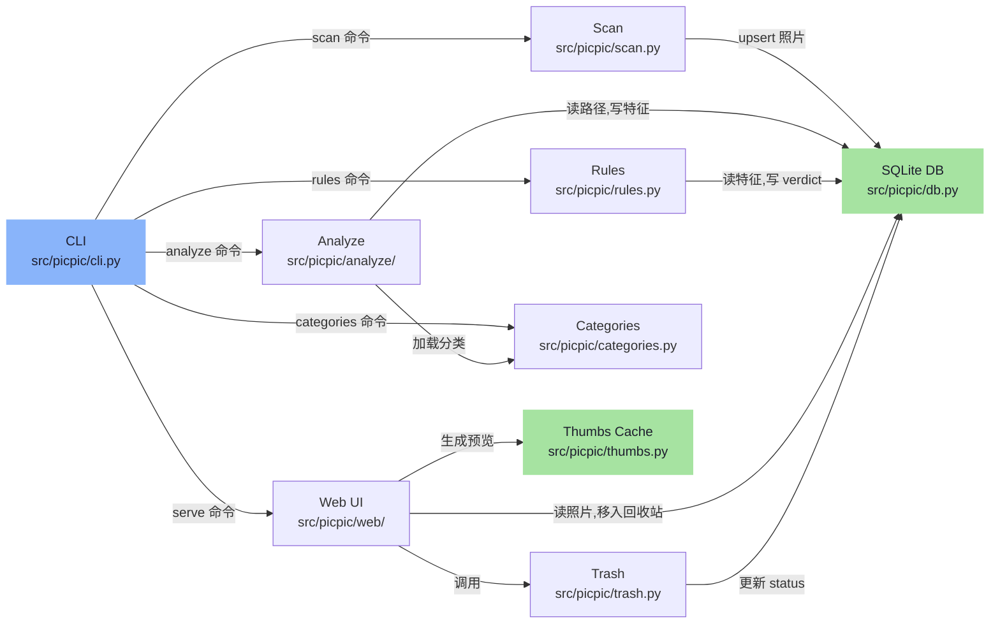
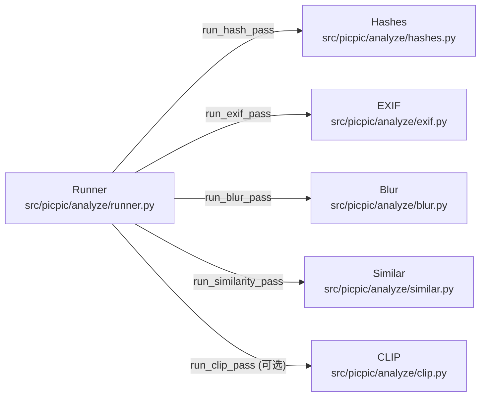
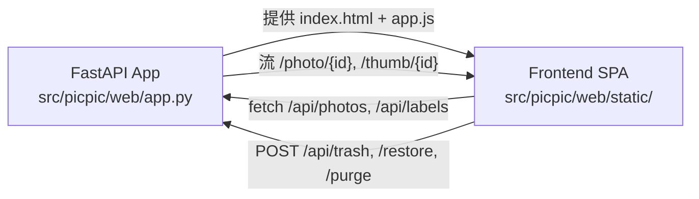
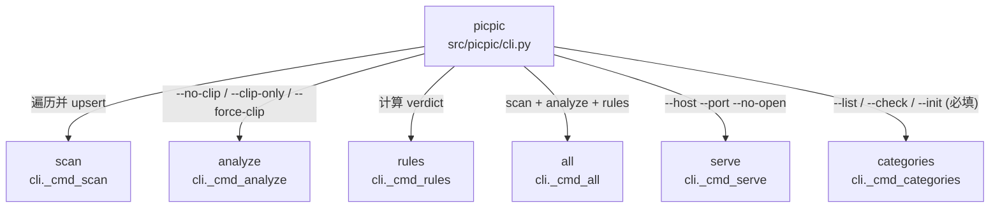
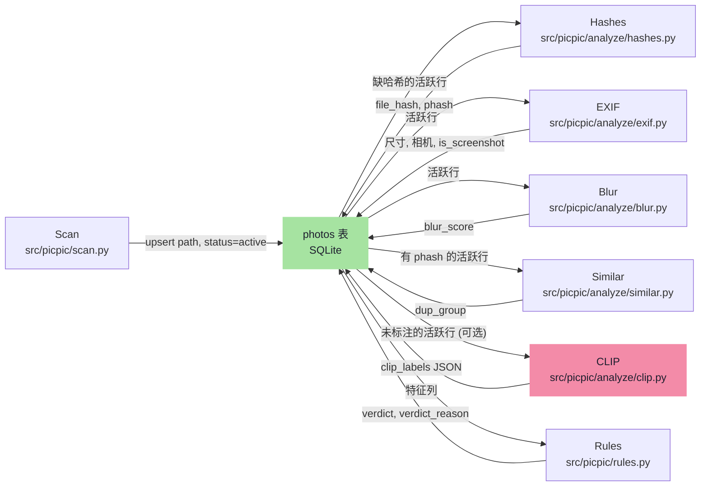
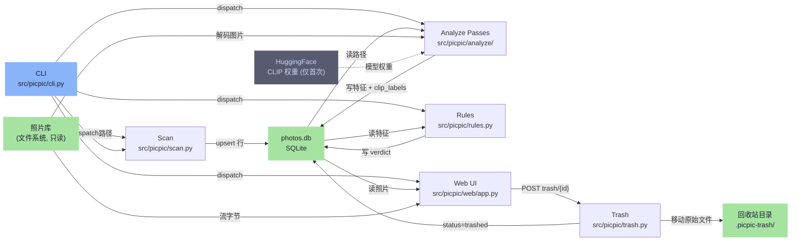

# picpic 架构文档

> 本文由 `.omm/` 目录中的架构快照翻译整理而来，可通过 `omm view` 在浏览器中查看原始 Mermaid 图。

## 目录

- [1. 总体架构 (overall-architecture)](#1-总体架构-overall-architecture)
- [2. 命令面 (command-surface)](#2-命令面-command-surface)
- [3. 处理流水线 (pipeline)](#3-处理流水线-pipeline)
- [4. 数据流 (data-flow)](#4-数据流-data-flow)

---

## 1. 总体架构 (overall-architecture)

### 概述

picpic 是一个本地隐私优先的照片整理工具。用户扫描本地照片库，运行分析器提取特征（哈希、EXIF、模糊度、近重复、CLIP 标签），应用规则标记待清理照片，然后通过本地 FastAPI 网页界面审阅并处理。所有处理都在本地完成；原始照片在整个生命周期内只读——只有 trash 模块可以移动文件，只有 `purge_trash` 可以物理删除。

### 全局约束

- **原始文件只读**：任何代码路径都不能写入、重命名或删除原始文件。仅 `src/picpic/trash.py` 允许移动文件；仅 `purge_trash` 允许物理删除。
- **SQLite 是单一事实来源**：UI 从不扫描文件系统来获取照片状态。
- **完全本地处理**：无网络调用、无遥测（唯一例外：首次运行时从 HuggingFace 下载 CLIP 模型权重）。
- **路径遍历防御**：`/photo/{id}` 与 `/thumb/{id}` 必须校验服务路径位于 library 根目录内。
- **Phase 2 边界**：不修改 `rules.py` 与 `trash.py`；CLIP 结果不参与 `verdict` 计算。

### 顶层结构图

### 顶层元素

#### CLI (`src/picpic/cli.py`)

基于 argparse 的命令分发器。提供六个子命令：`scan`、`analyze`、`rules`、`all`（依次串联 scan+analyze+rules）、`serve`（网页 UI）、`categories`（list/check/init YAML 分类）。每个子命令在打开数据库前都会验证 `library.exists() and is_dir()`。`analyze` 和 `all` 接受互斥的 `--no-clip` 与 `--clip-only`，以及 `--force-clip`。`categories` 要求 `--list`/`--check`/`--init` 三者必须选一个。

#### Scan (`src/picpic/scan.py`)

文件系统遍历器。在 library 根目录下发现图片文件（jpg/jpeg/png/heic/heif），每条路径 upsert 一行到 `photos` 表，`status='active'`。报告新增/已有行数。不会修改磁盘文件。

#### Analyze (`src/picpic/analyze/`) — 组

特征提取组。`runner.py` 编排五个 pass：hashes（`file_hash`、`phash`）、exif（尺寸、相机型号、截图启发式）、blur（拉普拉斯方差）、similar（phash Hamming 距离聚类为 `dup_group`）、clip（针对 `categories.yml` 的 zero-shot 分类）。CLIP pass 是可选的，由 `[clip]` extra 触发；失败时打印到 stderr 并保留 Phase 1 结果。

Analyze 内部结构：

- **Runner** — 各 pass 的协调者。签名 `(conn, library, *, run_clip, force_clip, clip_only)`；互斥标志控制哪些 pass 执行。CLIP 失败时捕获 `CategoriesError`/`ClipUnavailable`/`FileNotFoundError`/`OSError`/`RuntimeError`/`AssertionError`，打印到 stderr，Phase 1 结果原样返回。装了 `[clip]` extras 后首次 analyze 会自动写入默认 `categories.yml`。
- **Hashes** — 为每张活跃照片计算 `file_hash`（文件字节的 SHA256）和 `phash`（感知哈希）。两列都有值的照片跳过。为下游去重打基础。
- **EXIF** — 通过 Pillow 解析 EXIF：宽度、高度、`file_size`、`created_at`、`camera_model`。启发式规则：EXIF 缺失或尺寸匹配常见屏幕比例时置 `is_screenshot=1`。
- **Blur** — 拉普拉斯方差模糊估计器。加载图片，转灰度，计算拉普拉斯方差。低方差 → 高 `blur_score`。供 `rules.py` 的模糊阈值判断使用。
- **Similar** — 近重复聚类器。按 phash Hamming 距离低于阈值分组，同一 cluster 共享一个 `dup_group` 整数。`rules.py` 将 cluster 里除一张外的其余标记为 `trash_candidate`。
- **CLIP** — CLIP zero-shot 分类器。加载 open_clip 模型（默认 ViT-B-32/laion2b_s34b_b79k），编码 `categories.yml` 中的分类 prompt，编码图片 batch，减去 baseline anchor embedding，将 top-3（name, score）以 JSON 写入 `photos.clip_labels`。OOM（`RuntimeError` 包含 `"out of memory"`）时 batch 减半。单图解码错误打印 stderr 并跳过。可选依赖通过 `importlib.util.find_spec('torch')` 和 `find_spec('open_clip')` 探测。

#### Rules (`src/picpic/rules.py`)

确定性 verdict 引擎。读取特征列（`blur_score`、`dup_group`、`is_screenshot` 等），置 `verdict='trash_candidate'` 附加 `verdict_reason` 字符串，或置 `verdict='keep'`。不消费 `clip_labels`——Phase 2 的 CLIP 结果仅供参考。纯 Python，除 SQLite 外无 I/O。

#### Trash (`src/picpic/trash.py`)

文件变更的唯一所有者。`move_to_trash` 把原始文件迁到 library 根下的 `.picpic-trash/`，置 `status='trashed'`、`trashed_at`。`restore` 反向操作。`purge_trash` 是唯一允许物理删除文件的函数。代码库中没有其他模块写入原始文件。

#### Categories (`src/picpic/categories.py`)

CLIP zero-shot 分类的 YAML 分类加载器。把 `categories.yml` 解析成 `(name, prompts)` 列表，用于构建文本 embedding。保留 `未分类`（spec 规范字面量）作为未分类伪类别名，并在用户配置中拒绝该名称。PyYAML 通过 `importlib.util.find_spec` 惰性导入，未装 `[clip]` extra 时也能正常 import 本包。

#### Web UI (`src/picpic/web/`) — 组

FastAPI 网页 UI。提供四个 tab（all/candidates/trash/labeled）以及照片列表、缩略图流、回收站操作、分类标签查询等 REST 端点。渲染 vanilla-JS SPA（`static/app.js`），永不扫描文件系统——所有照片状态来自 SQLite。仅绑定 127.0.0.1。

Web 内部结构：

- **App** — FastAPI 应用。端点：`GET /`（SPA index）、`GET /api/photos?tab=...`（列出 active/candidates/trashed/labeled 照片）、`GET /api/labels`（分类计数）、`GET /photo/{id}` 与 `/thumb/{id}`（校验后路径服务）、`POST /api/trash/{id}`、`/restore/{id}`、`/purge`。`_photo_dict` 解析 `clip_labels` JSON，用 `isinstance(x, dict)` 过滤畸形行，抽取 `top_label`。`clip_labels` 为 NULL 时计入未分类。
- **Static SPA** — Vanilla-JS 单页应用。四个 tab。渲染照片网格与缩略图，分类 badge 用 `createElement + textContent`（XSS 安全），完整 top-k 显示在 title tooltip。按 tab 缓存 `labelsMeta`，在切 tab、min-score 滑杆变化（`change` 事件去抖）、以及 trash/restore/purge 后失效。

#### SQLite DB (`src/picpic/db.py`)

SQLite schema 与连接工厂。定义单张 `photos` 表（`path`、hash 列、EXIF、`blur_score`、`dup_group`、`clip_labels`、`verdict`、`status`、`trashed_at`）与 `meta` 表存 `schema_version`。`SCHEMA_VERSION=1`；Phase 2 复用现有 `clip_labels TEXT` 列，无 migration。`open_db` 启用外键并按需建表。

#### Thumbs Cache (`src/picpic/thumbs.py`)

按需缩略图缓存。为网页 UI 提供预览，按 photo id + 尺寸做 key，存在 `library/.picpic-thumbs/` 下。源图 mtime 更新时重新生成。不修改原始文件。

---

## 2. 命令面 (command-surface)

### 概述

`picpic` 入口点暴露的 argparse 子命令层次。每个子命令都需要必填的 `library` 位置参数（由 `_require_library` 校验：必须存在且是目录）。`analyze` 和 `all` 共享互斥的 `--no-clip`/`--clip-only`，加上 `--force-clip`。`serve` 接受 `--host`（默认 `127.0.0.1`）、`--port`（默认 `8765`）、`--no-open`。`categories` 要求 `--list`/`--check`/`--init` 精确选一。

### 命令树

### 子命令详解

| 命令 | 用法 | 行为 |
|---|---|---|
| `scan` | `picpic scan <library>` | 遍历 library 根目录，upsert 图片行进入 `photos` 表。幂等：已有路径刷新为 `status='active'`，不重算哈希。报告 `new_count` 与 `existing_count`。不修改原始文件。 |
| `analyze` | `picpic analyze <library> [--no-clip\|--clip-only] [--force-clip]` | 对活跃照片跑特征提取 pass。默认：五个 pass 全跑。`--no-clip` 跳过 CLIP。`--clip-only` 跳过 Phase 1。`--force-clip` 对已有 `clip_labels` 的照片重新标记。打印每个 pass 的计数。 |
| `rules` | `picpic rules <library>` | 对特征列跑确定性规则，写入 `verdict` 与 `verdict_reason`。纯数据库读写；不涉及文件 I/O。不消费 `clip_labels`。 |
| `all` | `picpic all <library> [--no-clip\|--clip-only] [--force-clip]` | 便捷命令：依次执行 scan、analyze（参数相同）、rules。任一步非零返回值即短路。 |
| `serve` | `picpic serve <library> [--host 127.0.0.1] [--port 8765] [--no-open]` | 通过 uvicorn 启动 FastAPI 网页 UI。默认仅绑定 loopback。除非指定 `--no-open`，否则启动时打开浏览器。 |
| `categories` | `picpic categories <library> --list\|--check\|--init` | 必填互斥组。`--list` 输出已解析分类。`--check` 校验 YAML 语法与保留名规则（拒绝 `未分类`）。`--init` 若不存在则写入默认 `categories.yml`。校验失败返回 2。若三个 flag 都没匹配（argparse 层面不可达），末尾防御性 `return 2` 兜底。 |

---

## 3. 处理流水线 (pipeline)

### 概述

特征提取与 verdict 流水线。照片流经六个分析器 stage，然后是 rules。每个 stage 从 SQLite 读取需要处理的行，把结果写回同一 `photos` 表的列——**SQLite 是协调层，不是内存队列**。Phase 1 stage（hashes、EXIF、blur、similar）总是运行；CLIP 是可选的，由 `[clip]` extra 加 `categories.yml` 存在共同触发。Rules 是终末 stage，产出 `verdict`/`verdict_reason`，不消费 `clip_labels`。

### 已知风险

CLIP stage 是整个产品**唯一的网络路径**——首次运行时下载 HuggingFace 模型权重。它也是唯一可能在 GPU 资源紧张的机器上 OOM 的 stage；runner 捕获 `RuntimeError` 中包含 `"out of memory"` 的错误，在重试循环中把 batch size 减半。CLIP 运行时单图解码错误会打印到 stderr 并跳过，避免一张坏图杀死整个 pass。

### 流水线图

### 各 stage 说明

| Stage | 描述 |
|---|---|
| **scan-stage** | 入口 stage。遍历 library 根，upsert 每张图片一行，`status='active'`。为下游所有分析 stage 提供输入集。 |
| **hashes-stage** | 计算 `file_hash`（SHA256）与 `phash`（感知哈希）。两列都有值的行跳过。`phash` 供 similar-stage 聚类使用。 |
| **exif-stage** | 通过 Pillow 提取 `width`/`height`/`file_size`/`created_at`/`camera_model`。用长宽比 + 缺失 EXIF 的启发式判断 `is_screenshot=1`。供 rules 做截图判定。 |
| **blur-stage** | 灰度图的拉普拉斯方差模糊估计。写 `blur_score`（越低越模糊）。供 rules 做模糊阈值判断。 |
| **similar-stage** | 按 phash Hamming 距离做近重复聚类。同 cluster 各行共享一个 `dup_group` 整数。Rules 将同组除一张外的其余标为 `trash_candidate`。 |
| **clip-stage** | 可选 zero-shot 分类器。加载 open_clip ViT-B-32/laion2b_s34b_b79k，编码 `categories.yml` 的 prompt 与 baseline anchor，编码图片 batch，减 anchor，将 top-3（name, score）以 JSON 写入 `clip_labels`。仅在 `torch` 与 `open_clip` 都可 import 且 `categories.yml` 存在时才运行。CUDA OOM 时 batch 减半。单图解码失败跳过并日志。 |
| **rules-stage** | 终末 stage。读 `blur_score`、`dup_group`、`is_screenshot` 等；写 `verdict='trash_candidate'\|'keep'` 附带 `verdict_reason` 字符串。纯 SQL 驱动。不消费 `clip_labels`——Phase 2 保持 CLIP 结果仅供参考。 |
| **db-store** | SQLite `photos` 表。作为 stage 之间的协调基质：每个 stage 读需要处理的行，把结果写回同一表的列。不存在独立的队列或内存流水线对象。 |

---

## 4. 数据流 (data-flow)

### 概述

从文件系统到 UI 到回收站的端到端数据流。磁盘上的照片是不可变源。Scan 只读路径。Analyze 从 SQLite 读路径，从磁盘解码图片字节，把特征列写回。Rules 读特征写 verdict。网页 UI 读 `photos` 行，把文件字节流给浏览器；用户回收某张照片时，Trash 模块把原始文件移到 `.picpic-trash/` 并更新 `status='trashed'`。HuggingFace 的虚线是唯一的网络出站，仅首次运行，受 `[clip]` extra 守卫。

### 数据流约束

- **原始文件永不离开 library 只读区**，直到 Trash 移动它们。没有其他代码路径写入原始文件。
- **SQLite 是照片状态的单一事实来源**。UI 从不扫描文件系统来回答查询。
- **CLIP 权重下载是产品中唯一的出站网络调用**。
- **`/photo/{id}` 与 `/thumb/{id}` 的路径遍历防御**：校验解析后的路径位于 library 根目录内。

### 数据流图

### 节点说明

**存储层**

- **照片库 (fs)** — 用户的照片目录。整条流水线只读。任意嵌套下的原始图片（jpg/jpeg/png/heic/heif）。Scan 遍历它；Analyze 解码它的字节；Web 流它的字节。
- **photos.db (sqlite)** — library 根下的 SQLite 数据库。每张照片状态的单一事实来源：文件身份（path、hashes）、特征（尺寸、EXIF、blur、`dup_group`、`clip_labels`）、verdict、生命周期状态（active/trashed）。scan/analyze/rules/trash 写入；web 读取。
- **回收站目录 (trash-fs)** — library 根下的 `.picpic-trash/`。被回收原始文件的目的地。只有 `trash.py` 向它写。只有 `purge_trash` 删字节。

**外部**

- **HuggingFace (huggingface)** — 托管 open_clip 模型权重的外部 CDN（默认 ViT-B-32/laion2b_s34b_b79k）。仅在首次 CLIP 运行且本地 torch cache 为空时联网。下载缓存在 `~/.cache/huggingface`。这是产品发起的唯一出站网络调用。

**处理节点**

- **CLI (cli-entry)** — 用户入口。分发到 scan/analyze/rules/serve 等。本身不产/不消费数据——只决定本次会话哪个模块持有连接。
- **Scan (scan-node)** — 从文件系统读路径（不读字节），upsert 每条路径一行到 `photos`，`status='active'`。
- **Analyze (analyze-node)** — 从 SQLite 读路径列表，从文件系统解码图片字节，计算特征（hashes、EXIF、blur、相似度聚类，可选 CLIP 标签），把结果写回特征列。
- **Rules (rules-node)** — 从 SQLite 读特征列，计算 `verdict` + `verdict_reason`，写回。无文件 I/O。
- **Web (web-node)** — 从 SQLite 读当前 tab 的照片行，为 `/photo/{id}` 与 `/thumb/{id}` 从文件系统流图片字节，把 trash/restore/purge POST 转发给 trash 模块。仅 loopback (127.0.0.1)。
- **Trash (trash-node)** — 唯一允许改动原始文件的模块。`move_to_trash` → 把原始文件移到 `.picpic-trash/` 并置 `status='trashed'`, `trashed_at`。`restore` → 反向。`purge_trash` → 唯一被允许物理删除字节的函数。

---

## 附录

- 原始 Mermaid 与字段元数据在 `.omm/` 目录，用 `omm view` 可交互浏览。
- Perspective 目录（截至本次生成）：`overall-architecture`、`command-surface`、`pipeline`、`data-flow`。
